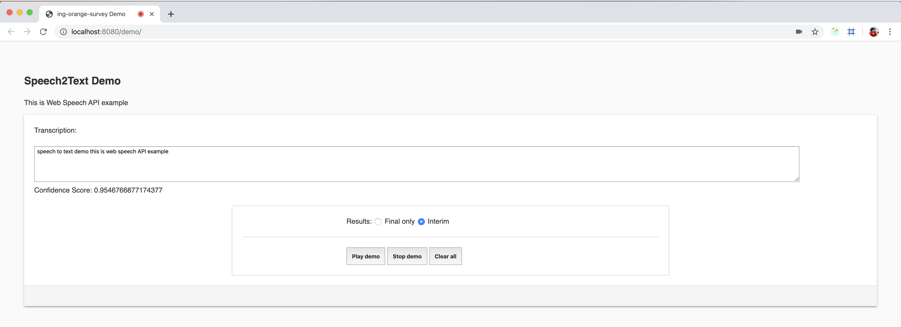

# speech2text

# StoryBoard
    The objective of this application is to incorporate speech recognition in my demo page. 
    Please create your own copy of this repo by 'Forking' it.
 
 ## Implementation
    
    Used Javascript web speech API to enable modern browsers recognize and synthesise speech
    

### API Supported functionalities:
    * Speech Grammer 
    * Continuous speech
    * Interim
        
 ## License

      
  
   
